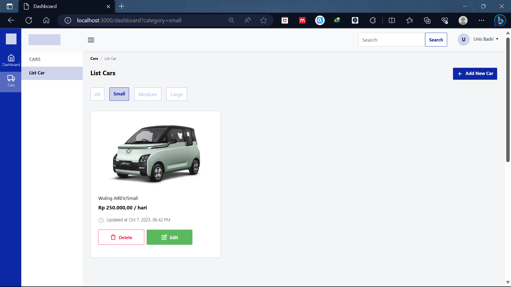

# Challenge 4

## Car Rental Management Dashboard

### Entity Relational Diagram :

Before start coding we should make an ERD because this can help us when we generate the models.


### Installations

Install dependencies for this project

```shell
npm install
```

### Set .env

```shell
DB_NAME=YOUR_DATABASE_NAME
DB_USERNAME=YOUR_DATABASE_USERNAME
DB_PASS=YOUR_POSTGRES_PASS
DB_HOST=YOUR_HOST
PORT=YOUR_PORT
IMAGEKIT_PUBKEY=IMAGEKIT_PUBLICKEY
IMAGEKIT_PRIVKEY=IMAGEKIT_PRIVATEKEY
IMAGEKIT_URL=YOUR_URL_ENDPOINT
```

### Server

```shell
npm run dev
localhost:3000/dashboard
```

#### Dashboard Cars Page

```shell
/dashboard
```


#### Create Car Page

```shell
/dashboard/create
```


#### Create Car Notification

```shell
/dashboard
```


#### Edit Car Page

```shell
/dashboard/edit/:id
```


#### Filter Category

```shell
/dashboard?category=small
```



#### Filter with Search

```shell
/dashboard?search=Jazz
```


#### Delete Modal

```shell
/dashboard
```


#### Delete Notification

```shell
/dashboard
```


### REST API

#### Get All Cars Data

- Request :
  `GET /api/v1/cars/`
- Response :

```json
{
  "status": "success",
  "data": {
    "cars": [
      {
        "id": 11,
        "name": "Toyota Supra MK4",
        "price": 5000000,
        "category": "medium",
        "image": "https://ik.imagekit.io/cbtfkvupm4/IMG-1696692619165_u6d4eLej5.png",
        "createdAt": "2023-10-07T15:23:24.478Z",
        "updatedAt": "2023-10-07T15:30:21.855Z"
      },
      {
        "id": 13,
        "name": "Wuling AIREV",
        "price": 200000,
        "category": "small",
        "image": "https://ik.imagekit.io/cbtfkvupm4/IMG-1696693811807_ZCYqRlfuH.png",
        "createdAt": "2023-10-07T15:50:15.312Z",
        "updatedAt": "2023-10-07T15:50:15.312Z"
      }
    ]
  }
}
```

#### Get Car Data By ID

- Request :
  `GET /api/v1/cars/11`
- Response :

```json
{
  "status": "success",
  "data": {
    "car": {
      "id": 11,
      "name": "Toyota Supra MK4",
      "price": 5000000,
      "category": "medium",
      "image": "https://ik.imagekit.io/cbtfkvupm4/IMG-1696692619165_u6d4eLej5.png",
      "createdAt": "2023-10-07T15:23:24.478Z",
      "updatedAt": "2023-10-07T15:30:21.855Z"
    }
  }
}
```

#### Create New Car Data

- Request :
  `POST /api/v1/cars`
- Request Body Form-Data :

| Key      |     Value      |
| :------- | :------------: |
| name     |   Honda Jazz   |
| price    |     350000     |
| category |     medium     |
| image    | honda_jazz.png |

- Response :

```json
{
  "status": "success",
  "data": {
    "car": {
      "id": 15,
      "name": "Honda Jazz",
      "price": 350000,
      "category": "medium",
      "image": "https://ik.imagekit.io/cbtfkvupm4/IMG-1696699774987_4-sjJ3ioF.jpg",
      "updatedAt": "2023-10-07T17:29:37.764Z",
      "createdAt": "2023-10-07T17:29:37.764Z"
    }
  }
}
```

#### Update Car Data

- Request :
  `PUT /api/v1/cars/15`
- Request Body Form-Data :

  | Key      |      Value      |
  | :------- | :-------------: |
  | name     |   Range Rover   |
  | price    |     5000000     |
  | category |      large      |
  | image    | range_rover.png |

- Response :

```json
{
  "status": "success",
  "message": "Data with ID 15 is updated"
}
```

#### Delete Car Data

- Request :
  `DELETE /api/v1/cars/15`

- Response :

```json
{
  "status": "success",
  "message": "Data with ID 15 is removed",
  "data": null
}
```
